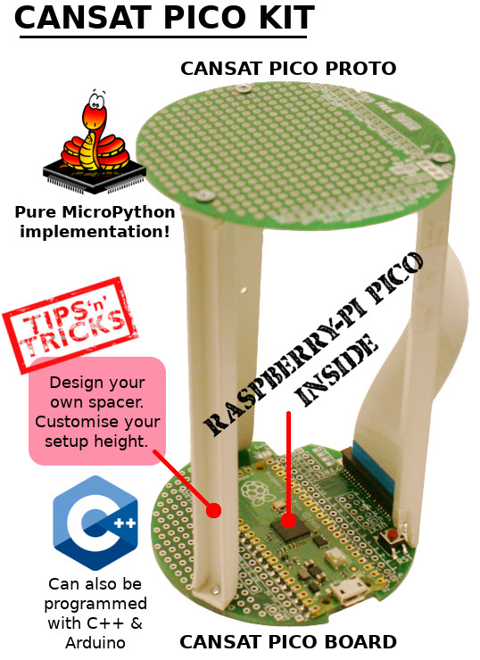

# Propel a CanSat with a Raspberry-Pi Pico under MicroPython

This GitHub holds the code for the [CanSat-Pico-Belgium Wiki](https://wiki.mchobby.be/index.php?title=ENG-CANSAT-PICO-BELGIUM) available at [cansat-pico.mchobby.be](https://cansat-pico.mchobby.be)

Please go to the wiki for:
* plateform description,
* wiring & schematics
* Example script,
* link to community page,
* etc.

Cheers, 
Dominique
